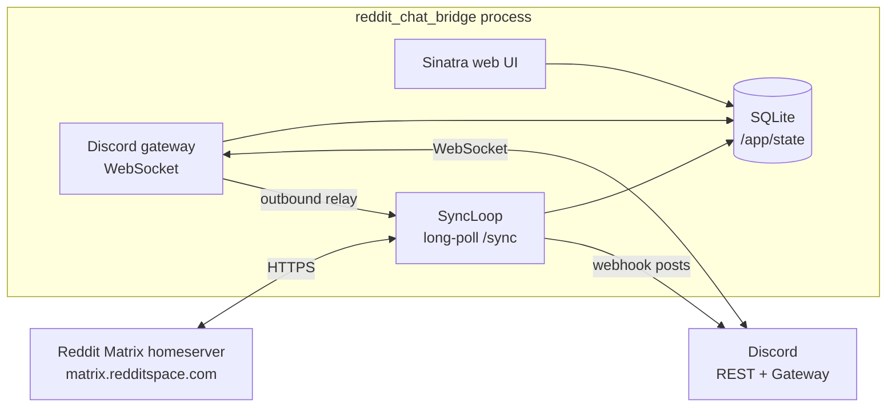
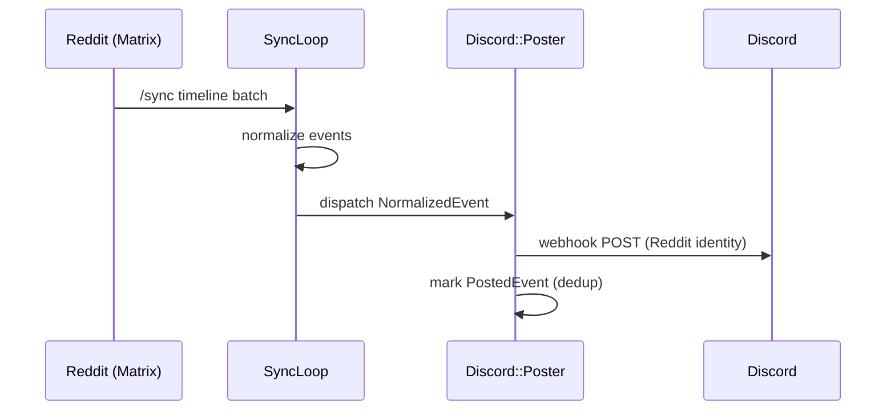
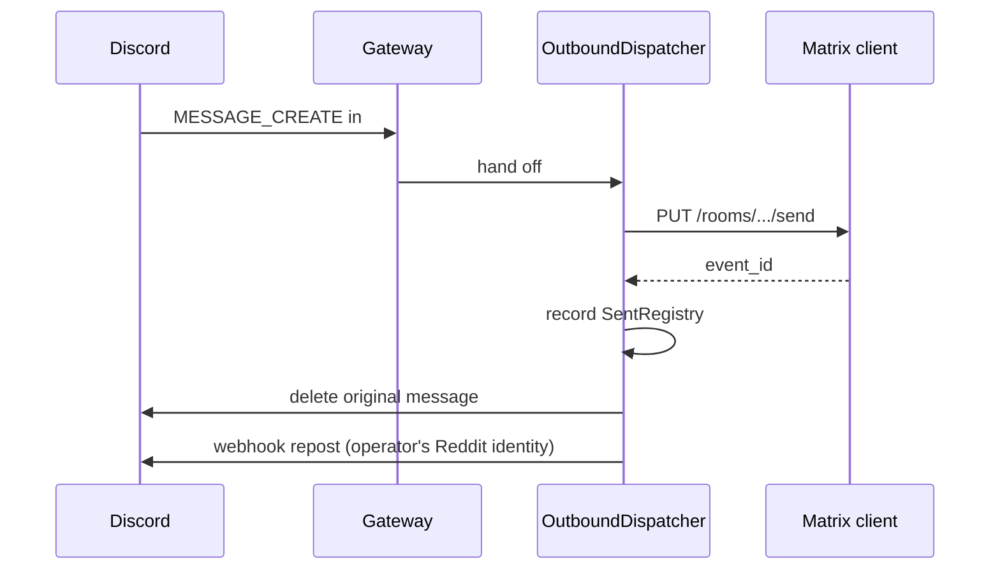

# Contributing

Issues and PRs are welcome. This document covers the project conventions, how to run the codebase locally, and the high-level architecture you'll see when you start reading the source.

## Conventions

- **TDD-first.** Write the failing test before the implementation.
- **Rubocop must be green.** CI gates on `bundle exec rubocop`. Use `bundle exec rubocop -a` to autocorrect.
- **`VERSION` bumps on every push to `main`.** The repo-committed pre-push hook enforces this locally; CI's `version-bump-check` job enforces it on GitHub. Run `bin/setup-hooks` once after cloning to activate the local hook. Bump rules follow conventional-commits: patch for fixes and refactors, minor for new features, major for breaking changes. Release-irrelevant pushes (every changed path matches `*.md`, `LICENSE`, `.github/**`, or `.githooks/**`) and dependabot-authored PRs are exempt from the bump rule. The same exemption set also short-circuits CI's per-arch build and publish, since none of those paths affect the released container image.
- **`CHANGELOG.md` gets the bump alongside `VERSION`.** Add an entry under the matching version section in the same commit that bumps `VERSION`. The CI release job sources GitHub Release bodies from this file.
- **Single-maintainer, reactive maintenance.** This is a small project with no active roadmap. Bug fixes and API-drift adjustments get attention; large new features may not.

Deeper conventions (testing patterns, service graph, Reddit and Matrix quirks discovered) are documented in [`CLAUDE.md`](./CLAUDE.md). Release history is in [`CHANGELOG.md`](./CHANGELOG.md).

## Local development

```bash
mise install              # ensures Ruby 4.0.3 (or use any other Ruby version manager)
bundle install
npm ci                    # Tailwind v4 + DaisyUI for the asset build
bin/setup-hooks           # activates the pre-push VERSION-bump gate
bin/start                 # boots Puma + background supervisor if configured
bundle exec rake test     # full suite (parallel minitest, 480+ tests)
bundle exec rubocop       # must be green for CI
```

## Architecture

One Ruby process. Sinatra + Puma for the web UI, a background supervisor thread running the Matrix `/sync` long-poll loop, and a Discord gateway WebSocket. State lives in SQLite under `/app/state` (a mounted volume, so it survives container recreation). All runtime config (Discord IDs, bot token, Reddit cookies) is stored in the database and edited through the web UI; environment variables are minimal.



Inbound (Reddit → Discord):



Outbound (Discord → Reddit):



## Stack

- Ruby 4.0.3, Sinatra + Puma (no Rails)
- Standalone ActiveRecord + ActiveSupport + SQLite
- Tailwind CSS v4 + DaisyUI v5 (standalone CLI, built into the Docker image)
- Faraday for Matrix and Discord REST; `websocket-client-simple` for the Discord gateway
- Mocha + WebMock + ActiveSupport::TestCase, TDD throughout
