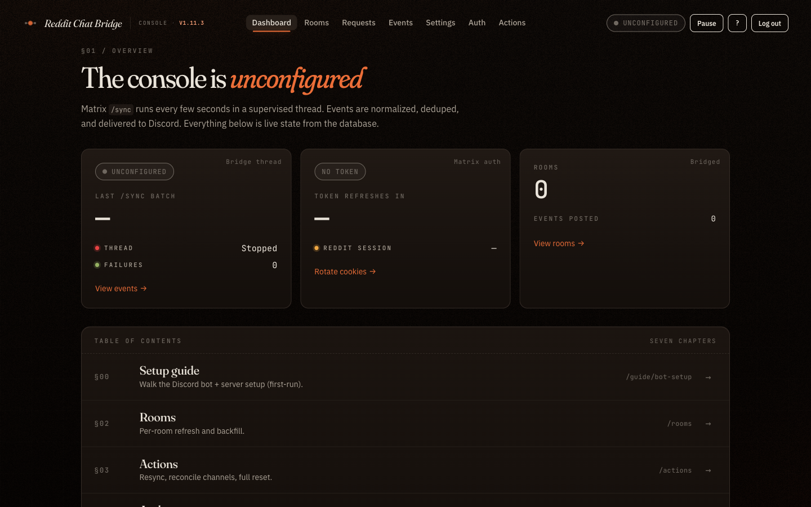
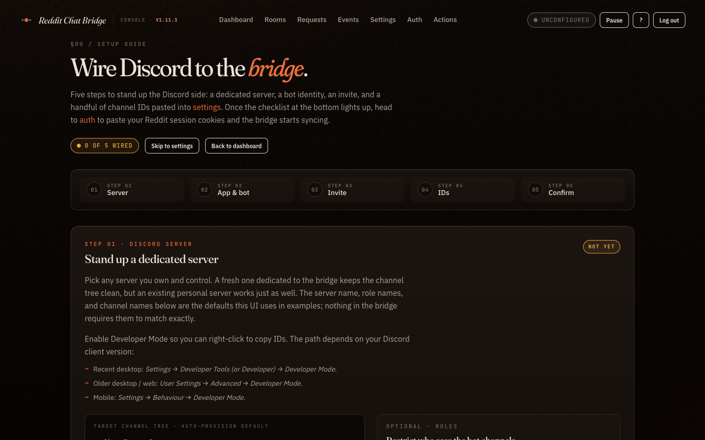
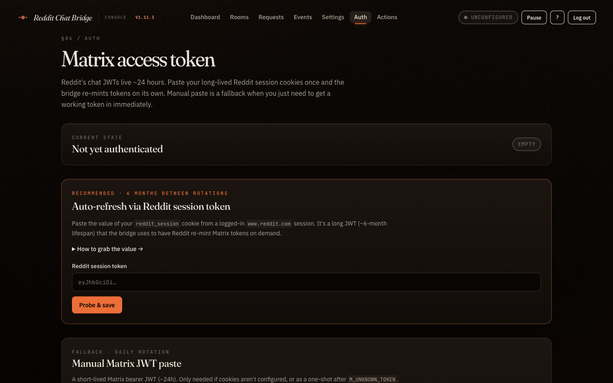
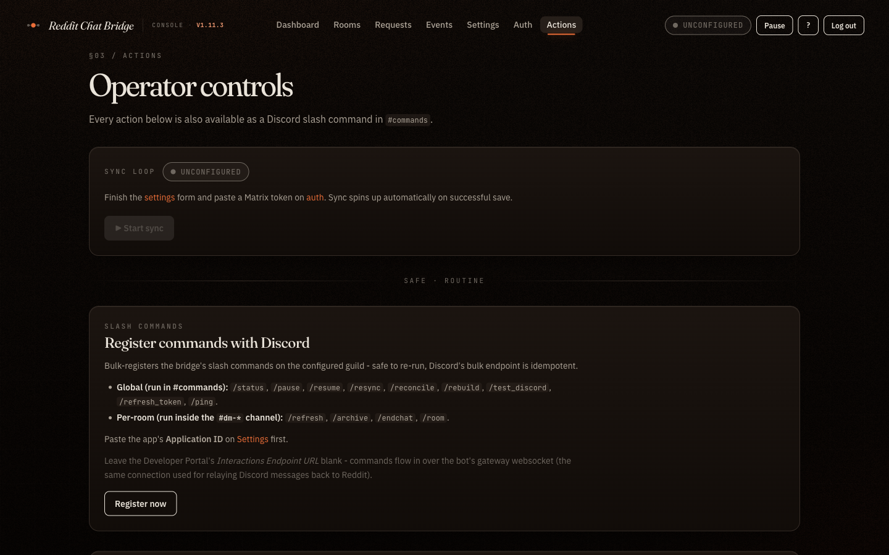
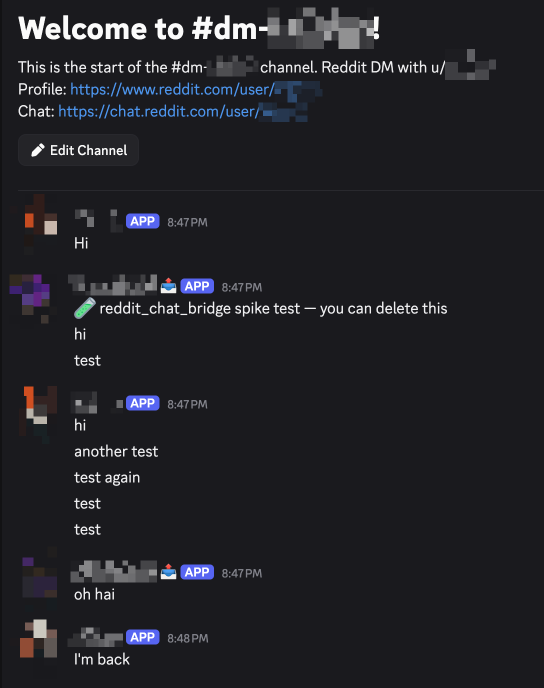
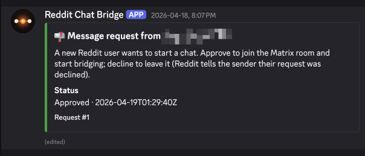

# Reddit Chat Bridge

A self-hosted bridge between Reddit Chat and a private Discord server. Reddit Chat is Matrix under the hood (homeserver `matrix.redditspace.com`), so this is a specialized Matrix ↔ Discord bridge that targets Reddit specifically.

[](https://github.com/mmenanno/reddit_chat_bridge/actions/workflows/ci.yml)
[](./VERSION)
[](./.ruby-version)
[](./LICENSE)


## Why this exists

Reddit's chat UI is hard to use. It doesn't reliably notify you of new messages when you're not on the site, it gets buggy, and the ergonomics are generally rough. This bridge fans your Reddit DMs out into your existing Discord workflow so notifications, history, and search all live in one place. The ugly part of dealing with Reddit's Matrix server (auth, JWT refresh, deduplication, channel lifecycle) is hidden behind a small admin web UI.

## Screenshots

### Admin web UI

The console in its first-run state.

<table>
  <tr>
    <td width="50%"></td>
    <td width="50%"></td>
  </tr>
  <tr>
    <td width="50%"></td>
    <td width="50%"></td>
  </tr>
</table>

### Discord side

A bridged `#dm-*` channel with persona-rewritten messages, and a message-request card from `#message-requests`. Reddit usernames and avatars are blurred for privacy.

<table>
  <tr>
    <td width="60%" valign="top"></td>
    <td width="40%" valign="top"></td>
  </tr>
</table>

## Features

### Bridging

- **Bidirectional.** Reddit chat events appear in per-conversation `#dm-<username>` channels under a "Reddit DMs" category. Messages typed in those channels are relayed to Reddit.
- **Identity preservation.** Every message posts via a channel-owned webhook so bubbles show the real Reddit display name and snoovatar instead of the bot. Outbound messages typed in Discord are deleted and reposted under the operator's Reddit identity, so the channel reads uniformly regardless of which side the message originated on.
- **Snoovatar fallback.** When Matrix lazy-loaded state has no avatar for a user, the bridge falls back to `/user/<name>/about.json` so you almost always get a real avatar, not a default placeholder.
- **Auto image embedding.** Reddit `mxc://` media URIs resolve to https on the fly so images embed inline in Discord.

### Channel and chat lifecycle

- **Auto-create / auto-rename.** New conversations create their channel + webhook on first event. When a username later resolves (Matrix lazy-loaded state often arrives late), the channel is renamed to match.
- **Auto-reorder.** `#dm-*` channels are bulk-reordered most-recent-first on every batch via Discord's bulk channel-position endpoint, so the active conversation is always at the top.
- **Message request gating.** Messages from strangers land as a card in `#message-requests` with Approve and Decline buttons. Approve joins the Matrix room and starts bridging; Decline leaves the invite so future DMs surface as fresh requests.
- **Archive.** Soft state. Deletes the Discord channel but keeps the Matrix link; the next inbound message auto-unarchives and recreates the channel.
- **End chat.** Hard local hide. Reddit's Matrix server refuses `/leave` on DM rooms (the same limitation Reddit's own "Hide chat" button works around), so the bridge marks the room terminated locally and filters every future event for that room.

### Reliability

- **Idempotent.** Inbound dedup against `posted_events`; outbound dedup against `outbound_messages`. Sync echoes of operator-typed messages don't double-post.
- **Self-healing.** A manually-deleted Discord channel or webhook is detected on next post and recreated automatically. The bridge never advances its `/sync` checkpoint until a batch posts successfully, so an outage doesn't drop messages.
- **Rate-limit aware.** Discord 429 responses are respected (`retry_after` honored, up to 3 retries per message).
- **Auto JWT refresh.** The Matrix access token is re-minted from stored Reddit cookies when less than an hour remains. No restarts, no operator action.

### Operator surface

- **Web admin UI.** Bcrypt-protected admin login, with pages for the dashboard, settings, auth, room list and per-room transcript, message requests, action panel, and an events log. The events log is a journal-tail of every operational message the bridge has emitted.
- **Slash command surface.** 13 commands (see [Slash command reference](#slash-command-reference) below).
- **In-app setup wizard.** First-run users land on `/guide/bot-setup`, which walks through Discord application creation, builds an invite URL, and live-tracks which configuration fields are still missing.
- **Operator alerts.** `#app-status` pings on Matrix auth failure, missing Discord permissions, and a T-7-day Reddit cookie expiry warning. `#app-logs` carries the operational log tail.

## Slash command reference

Source of truth: [`lib/discord/slash_command_router.rb`](./lib/discord/slash_command_router.rb).

### Global commands

Run these in your configured `#commands` channel.

| Command | Effect |
| ------- | ------ |
| `/status` | Show sync state, Matrix auth state, sync cadence, last `/sync` batch timestamp, cookie expiry. |
| `/pause` | Pause the `/sync` loop without dropping the Matrix token. |
| `/resume` | Resume the `/sync` loop after a manual pause. |
| `/resync` | Clear the `/sync` checkpoint so the next iteration runs as a fresh initial sync. Useful when sync state looks stale or you want pending invites re-fetched in one shot. |
| `/reconcile` | Sweep every active room and rename channels to current Reddit usernames. Reports renamed / unchanged / skipped / errors. |
| `/refresh_token` | Mint a fresh Matrix JWT from stored Reddit cookies. |
| `/ping` | Health check. Replies pong. |
| `/rebuild` | Refresh every active room: rename and replay recent history. Skips archived and terminated rooms. Non-destructive. |
| `/unarchive <query>` | Fuzzy-match an archived room by Reddit username, then confirm to unarchive (with backfill). Shows a button picker when multiple rooms match. |
| `/restore <query>` | Counterpart for terminated (hidden) chats. Same fuzzy + confirm flow. |

The bridge long-polls Matrix `/sync` with a 10-second idle timeout. Idle, that's a tick every ~10s; when events are flowing, the server returns immediately and bridging is effectively real-time.

### Per-room commands

Run these inside a `#dm-*` channel; the bridge resolves the target room from the channel.

| Command | Effect |
| ------- | ------ |
| `/refresh` | Refresh this chat: rename and replay recent history. |
| `/archive` | Archive this chat. Channel is deleted; auto-recreates on next message. |
| `/endchat` | Hide this chat. Delete the channel and drop future events for the room. Future DMs come back as a new message request. |
| `/room` | Show diagnostic info for this chat (IDs, webhook status, state). |

## Limitations and non-goals

- **Reddit cookie auto-rotation is unsolved.** When the stored `reddit_session` cookie nears expiry (~6 months), the bridge warns 7 days out and the operator pastes a fresh cookie on `/auth`. This stays manual until Reddit exposes a long-lived refresh path.
- **Reddit → Discord edit and redaction sync is not implemented.** Edits and deletions on the Reddit side don't propagate to Discord.
- **Single-server, single-operator design.** No multi-tenancy. The bridge is meant to be your personal bridge for your account.

## Prerequisites

- A Reddit account with chat enabled.
- A Discord server you control, plus a Discord application and bot you can create.
- A host that can run a Docker container 24/7 (a VPS, home server, Raspberry Pi, NAS, Unraid box, etc.).
- A way to reach the web UI from your browser. LAN, Tailscale, a reverse proxy. Up to you.

## Quick start (Docker)

```bash
docker run -d \
  --name reddit_chat_bridge \
  --restart unless-stopped \
  -p 4567:4567 \
  -v "$PWD/state:/app/state" \
  ghcr.io/mmenanno/reddit_chat_bridge:latest
```

The container persists everything to the mounted `state/` directory. The entrypoint chowns this directory on first boot to match the runtime user (default uid/gid `1000:1000`); set `PUID` / `PGID` env vars to align with a different host convention (e.g. Unraid's `99:100`).

For a Compose-based deploy, [`docker-compose.yml`](./docker-compose.yml) at the repo root is a working starting point. See [`guides/deployment.md`](./guides/deployment.md) for a full deployment walkthrough including updates and reverse-proxy notes.

### First-run flow

1. Open the web UI at `http://<your-host>:4567/`. First load lands on `/setup`.
2. Create the admin account (12+ character password).
3. The wizard at `/guide/bot-setup` walks through creating a Discord application and bot, mints the invite URL, and prompts for each Discord ID. Save when the form goes green.
4. On `/auth`, paste your `reddit_session` cookie (preferred, ~6 month lifetime) or a short-lived Matrix JWT. There's a drag-to-bookmark helper that grabs a fresh JWT from any logged-in reddit.com tab. Probe and save.
5. **Restart the container once** so the supervisor picks up the now-complete config and starts the background sync thread. Subsequent settings/token changes take effect live; only the very first boot needs this.

## Configuration

| Env var | Default | Notes |
| ------- | ------- | ----- |
| `PORT` | `4567` | Web UI bind port. |
| `RACK_ENV` | `production` | Don't override for production. |

Everything else (Discord bot token, application ID, guild ID, channel IDs, operator user IDs, Reddit auth) lives in the SQLite database and is edited through the web UI. There are no env-var-based secrets.

The Reddit cookie jar is encrypted at rest with a key derived from `AppConfig.session_secret`, which is auto-generated on first boot if not supplied via `SESSION_SECRET`.

## Admin web UI

| Path | Purpose |
| ---- | ------- |
| `/` | Dashboard: Matrix and Discord status, sync checkpoint, cookie expiry. |
| `/settings` | Discord IDs (bot token, application, guild, channels, operator user IDs). |
| `/auth` | Reddit session cookie + Matrix JWT entry, with a probe-before-save flow. |
| `/guide/bot-setup` | First-run Discord setup wizard (live-tracks missing IDs, mints an invite URL). |
| `/rooms` | All bridged DM rooms (active / archived / hidden tabs) with per-room actions. |
| `/rooms/:id` | Per-room transcript with manual refresh/archive/end/restore controls. |
| `/requests` | Pending Reddit message requests with Approve/Decline. |
| `/actions` | Admin action panel: resync, pause/resume, reconcile, rebuild, test Discord, register slash commands. |
| `/events` | Journal-tail of operational events (filterable by level + source). |
| `/health` | Container health probe; returns 200 when Puma is up and the DB is queryable. |

