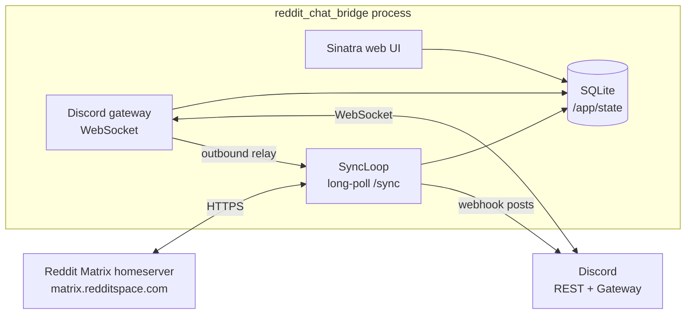
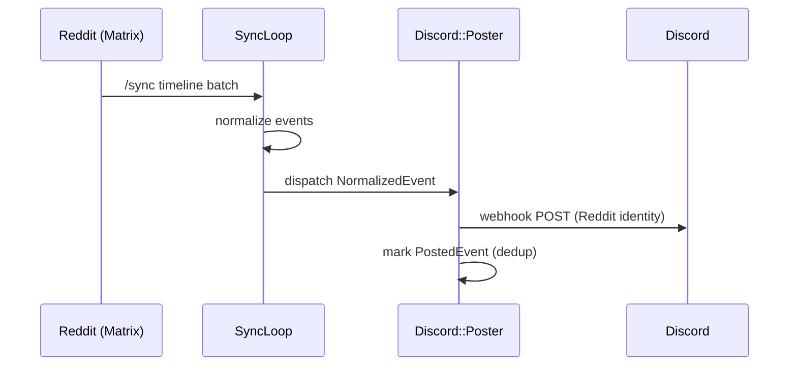
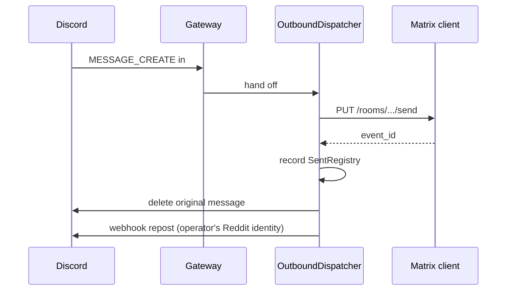

# reddit_chat_bridge

A self-hosted bridge between Reddit Chat and a private Discord server. Reddit Chat is Matrix under the hood (homeserver `matrix.redditspace.com`), so this is a specialized Matrix ↔ Discord bridge that targets Reddit specifically.

[](https://github.com/mmenanno/reddit_chat_bridge/actions/workflows/ci.yml)
[](./VERSION)
[](./.ruby-version)
[](./LICENSE)


## Why this exists

Reddit's chat UI is hard to use. It doesn't reliably notify you of new messages when you're not on the site, it gets buggy, and the ergonomics are generally rough. This bridge fans your Reddit DMs out into your existing Discord workflow so notifications, history, and search all live in one place. The ugly part of dealing with Reddit's Matrix server (auth, JWT refresh, deduplication, channel lifecycle) is hidden behind a small admin web UI.

## Features

### Bridging

- **Bidirectional.** Reddit chat events appear in per-conversation `#dm-<username>` channels under a "Reddit DMs" category. Messages typed in those channels are relayed to Reddit.
- **Identity preservation.** Every message posts via a channel-owned webhook so bubbles show the real Reddit display name and snoovatar instead of the bot. Outbound messages typed in Discord are deleted and reposted under the operator's Reddit identity, so the channel reads uniformly regardless of which side the message originated on.
- **Snoovatar fallback.** When Matrix lazy-loaded state has no avatar for a user, the bridge falls back to `/user/<name>/about.json` so you almost always get a real avatar, not a default placeholder.
- **Auto image embedding.** Reddit `mxc://` media URIs resolve to https on the fly so images embed inline in Discord.

### Channel and chat lifecycle

- **Auto-create / auto-rename.** New conversations create their channel + webhook on first event. When a username later resolves (Matrix lazy-loaded state often arrives late), the channel is renamed to match.
- **Auto-reorder.** `#dm-*` channels are bulk-reordered most-recent-first on every batch via Discord's bulk channel-position endpoint, so the active conversation is always at the top.
- **Message request gating.** Messages from strangers land as a card in `#message-requests` with Approve and Decline buttons. Approve joins the Matrix room and starts bridging; Decline leaves the invite so future DMs surface as fresh requests.
- **Archive.** Soft state. Deletes the Discord channel but keeps the Matrix link; the next inbound message auto-unarchives and recreates the channel.
- **End chat.** Hard local hide. Reddit's Matrix server refuses `/leave` on DM rooms (the same limitation Reddit's own "Hide chat" button works around), so the bridge marks the room terminated locally and filters every future event for that room.

### Reliability

- **Idempotent.** Inbound dedup against `posted_events`; outbound dedup against `outbound_messages`. Sync echoes of operator-typed messages don't double-post.
- **Self-healing.** A manually-deleted Discord channel or webhook is detected on next post and recreated automatically. The bridge never advances its `/sync` checkpoint until a batch posts successfully, so an outage doesn't drop messages.
- **Rate-limit aware.** Discord 429 responses are respected (`retry_after` honored, up to 3 retries per message).
- **Auto JWT refresh.** The Matrix access token is re-minted from stored Reddit cookies when less than an hour remains. No restarts, no operator action.

### Operator surface

- **Web admin UI.** Bcrypt-protected admin login, with pages for the dashboard, settings, auth, room list and per-room transcript, message requests, action panel, and an events log. The events log is a journal-tail of every operational message the bridge has emitted.
- **Slash command surface.** 13 commands (see [Slash command reference](#slash-command-reference) below).
- **In-app setup wizard.** First-run users land on `/guide/bot-setup`, which walks through Discord application creation, builds an invite URL, and live-tracks which configuration fields are still missing.
- **Operator alerts.** `#app-status` pings on Matrix auth failure, missing Discord permissions, and a T-7-day Reddit cookie expiry warning. `#app-logs` carries the operational log tail.

## Limitations and non-goals

- **Reddit cookie auto-rotation is unsolved.** When the stored `reddit_session` cookie nears expiry (~6 months), the bridge warns 7 days out and the operator pastes a fresh cookie on `/auth`. This stays manual until Reddit exposes a long-lived refresh path.
- **Reddit → Discord edit and redaction sync is not implemented.** Edits and deletions on the Reddit side don't propagate to Discord.
- **Single-server, single-operator design.** No multi-tenancy. The bridge is meant to be your personal bridge for your account.

## Architecture

One Ruby process. Sinatra + Puma for the web UI, a background supervisor thread running the Matrix `/sync` long-poll loop, and a Discord gateway WebSocket. State lives in SQLite under `/app/state` (a mounted volume, so it survives container recreation). All runtime config (Discord IDs, bot token, Reddit cookies) is stored in the database and edited through the web UI; environment variables are minimal.



Inbound (Reddit → Discord):



Outbound (Discord → Reddit):



## Prerequisites

- A Reddit account with chat enabled.
- A Discord server you control, plus a Discord application and bot you can create.
- A host that can run a Docker container 24/7 (a VPS, home server, Raspberry Pi, NAS, Unraid box, etc.).
- A way to reach the web UI from your browser. LAN, Tailscale, a reverse proxy. Up to you.

## Quick start (Docker)

```bash
docker run -d \
  --name reddit_chat_bridge \
  --restart unless-stopped \
  --user 1000:1000 \
  -p 4567:4567 \
  -v "$PWD/state:/app/state" \
  ghcr.io/mmenanno/reddit_chat_bridge:latest
```

The container persists everything to the mounted `state/` directory. The host directory must be owned by uid/gid `1000:1000` (the user the container runs as) so SQLite can write to it.

For a Compose-based deploy, [`docker-compose.yml`](./docker-compose.yml) at the repo root is a working starting point. See [`guides/deployment.md`](./guides/deployment.md) for a full deployment walkthrough including updates and reverse-proxy notes.

### First-run flow

1. Open the web UI at `http://<your-host>:4567/`. First load lands on `/setup`.
2. Create the admin account (12+ character password).
3. The wizard at `/guide/bot-setup` walks through creating a Discord application and bot, mints the invite URL, and prompts for each Discord ID. Save when the form goes green.
4. On `/auth`, paste your `reddit_session` cookie (preferred, ~6 month lifetime) or a short-lived Matrix JWT. There's a drag-to-bookmark helper that grabs a fresh JWT from any logged-in reddit.com tab. Probe and save.
5. **Restart the container once** so the supervisor picks up the now-complete config and starts the background sync thread. Subsequent settings/token changes take effect live; only the very first boot needs this.

## Configuration

| Env var | Default | Notes |
| ------- | ------- | ----- |
| `PORT` | `4567` | Web UI bind port. |
| `RACK_ENV` | `production` | Don't override for production. |

Everything else (Discord bot token, application ID, guild ID, channel IDs, operator user IDs, Reddit auth) lives in the SQLite database and is edited through the web UI. There are no env-var-based secrets.

The Reddit cookie jar is encrypted at rest with a key derived from `AppConfig.session_secret`, which is auto-generated on first boot if not supplied via `SESSION_SECRET`.

## Slash command reference

Source of truth: [`lib/discord/slash_command_router.rb`](./lib/discord/slash_command_router.rb).

### Global commands

Run these in your configured `#commands` channel.

| Command | Effect |
| ------- | ------ |
| `/status` | Show sync state, Matrix auth state, last `/sync` batch timestamp, cookie expiry. |
| `/pause` | Pause the `/sync` loop without dropping the Matrix token. |
| `/resume` | Resume the `/sync` loop after a manual pause. |
| `/resync` | Clear the `/sync` checkpoint and re-pull recent history. |
| `/reconcile` | Sweep every room and rename channels to current Reddit usernames. |
| `/refresh_token` | Mint a fresh Matrix JWT from stored Reddit cookies. |
| `/ping` | Health check. Replies pong. |
| `/rebuild` | Refresh every room: rename and replay recent history. Non-destructive. |
| `/test_discord` | Probe Discord by posting a hello line to `#app-status`. |

### Per-room commands

Run these inside a `#dm-*` channel; the bridge resolves the target room from the channel.

| Command | Effect |
| ------- | ------ |
| `/refresh` | Refresh this chat: rename and replay recent history. |
| `/archive` | Archive this chat. Channel is deleted; auto-recreates on next message. |
| `/endchat` | Hide this chat. Delete the channel and drop future events for the room. Future DMs come back as a new message request. |
| `/room` | Show diagnostic info for this chat (IDs, webhook status, state). |

## Admin web UI

| Path | Purpose |
| ---- | ------- |
| `/` | Dashboard: Matrix and Discord status, sync checkpoint, cookie expiry. |
| `/settings` | Discord IDs (bot token, application, guild, channels, operator user IDs). |
| `/auth` | Reddit session cookie + Matrix JWT entry, with a probe-before-save flow. |
| `/guide/bot-setup` | First-run Discord setup wizard (live-tracks missing IDs, mints an invite URL). |
| `/rooms` | All bridged DM rooms (active / archived / hidden tabs) with per-room actions. |
| `/rooms/:id` | Per-room transcript with manual refresh/archive/end/restore controls. |
| `/requests` | Pending Reddit message requests with Approve/Decline. |
| `/actions` | Admin action panel: resync, pause/resume, reconcile, rebuild, test Discord, register slash commands. |
| `/events` | Journal-tail of operational events (filterable by level + source). |
| `/health` | Container health probe; returns 200 when Puma is up and the DB is queryable. |

## Local development

```bash
mise install              # ensures Ruby 4.0.2 (or use any other Ruby version manager)
bundle install
npm ci                    # Tailwind v4 + DaisyUI for the asset build
bin/setup-hooks           # activates the pre-push VERSION-bump gate
bin/start                 # boots Puma + background supervisor if configured
bundle exec rake test     # full suite (parallel minitest, 480+ tests)
bundle exec rubocop       # must be green for CI
```

## Stack

- Ruby 4.0.2, Sinatra + Puma (no Rails)
- Standalone ActiveRecord + ActiveSupport + SQLite
- Tailwind CSS v4 + DaisyUI v5 (standalone CLI, built into the Docker image)
- Faraday for Matrix and Discord REST; `websocket-client-simple` for the Discord gateway
- Mocha + WebMock + ActiveSupport::TestCase, TDD throughout

## Contributing

Issues and PRs are welcome. A few conventions to know up front:

- **TDD-first.** Write the failing test before the implementation.
- **Rubocop must be green.** CI gates on `bundle exec rubocop`. Use `bundle exec rubocop -a` to autocorrect.
- **`VERSION` bumps on every push to `main`.** The repo-committed pre-push hook enforces this locally; CI's `version-bump-check` job enforces it on GitHub. Run `bin/setup-hooks` once after cloning to activate the local hook. Bump rules follow conventional-commits: patch for fixes and refactors, minor for new features, major for breaking changes. Docs-only pushes (every changed path matches `*.md` or `LICENSE`) and dependabot-authored PRs are exempt from the bump rule.
- **`CHANGELOG.md` gets the bump alongside `VERSION`.** Add an entry under the matching version section in the same commit that bumps `VERSION`. The CI release job sources GitHub Release bodies from this file.
- **Single-maintainer, reactive maintenance.** This is a small project with no active roadmap. Bug fixes and API-drift adjustments get attention; large new features may not.

Deeper conventions (testing patterns, service graph, Reddit/Matrix quirks discovered) are documented in [`CLAUDE.md`](./CLAUDE.md). Release history is in [`CHANGELOG.md`](./CHANGELOG.md).

## Security

If you've found a security issue, please report it privately. See [`SECURITY.md`](./SECURITY.md) for the disclosure channel and what is in scope.

## License

MIT. See [`LICENSE`](./LICENSE).
